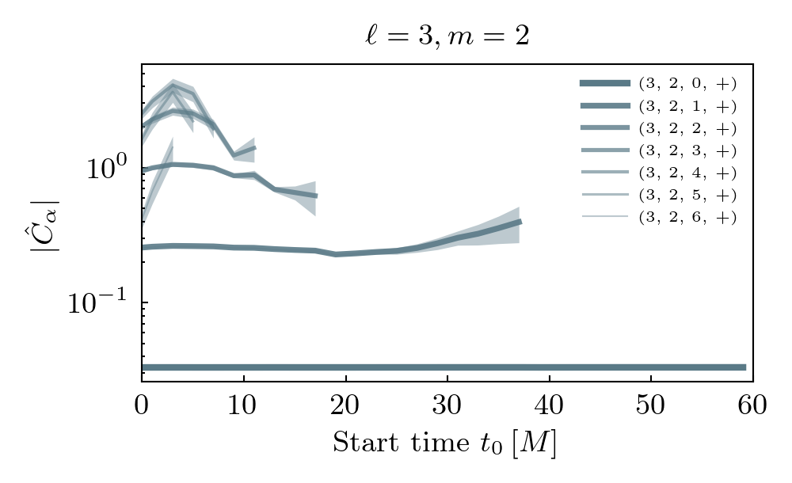
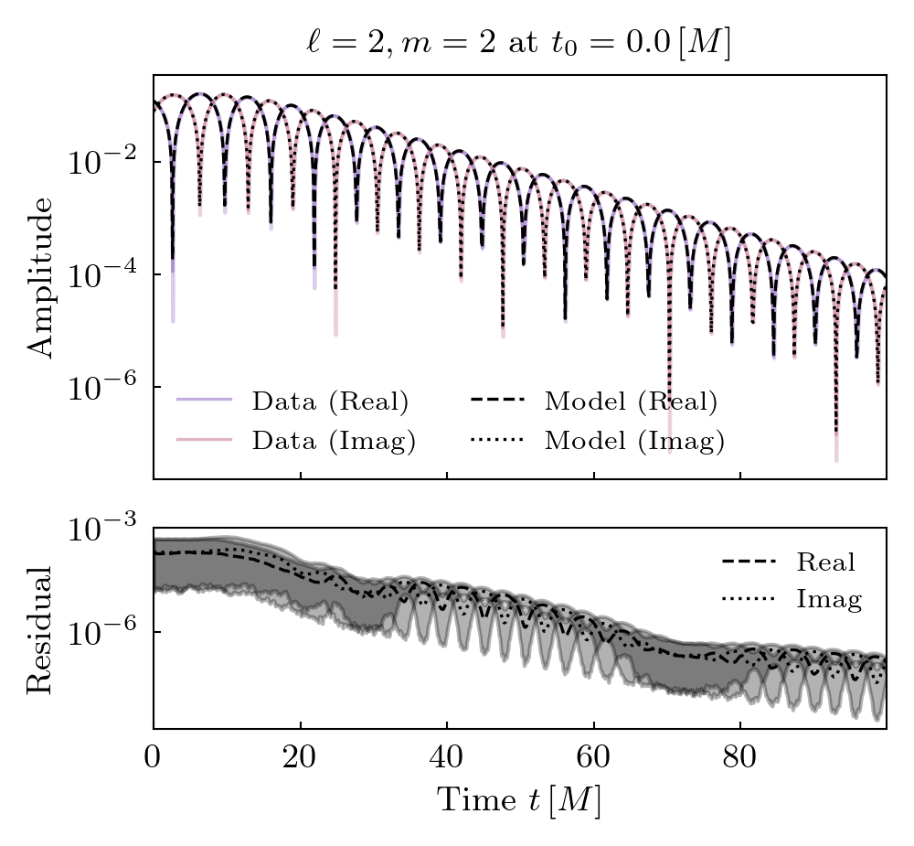
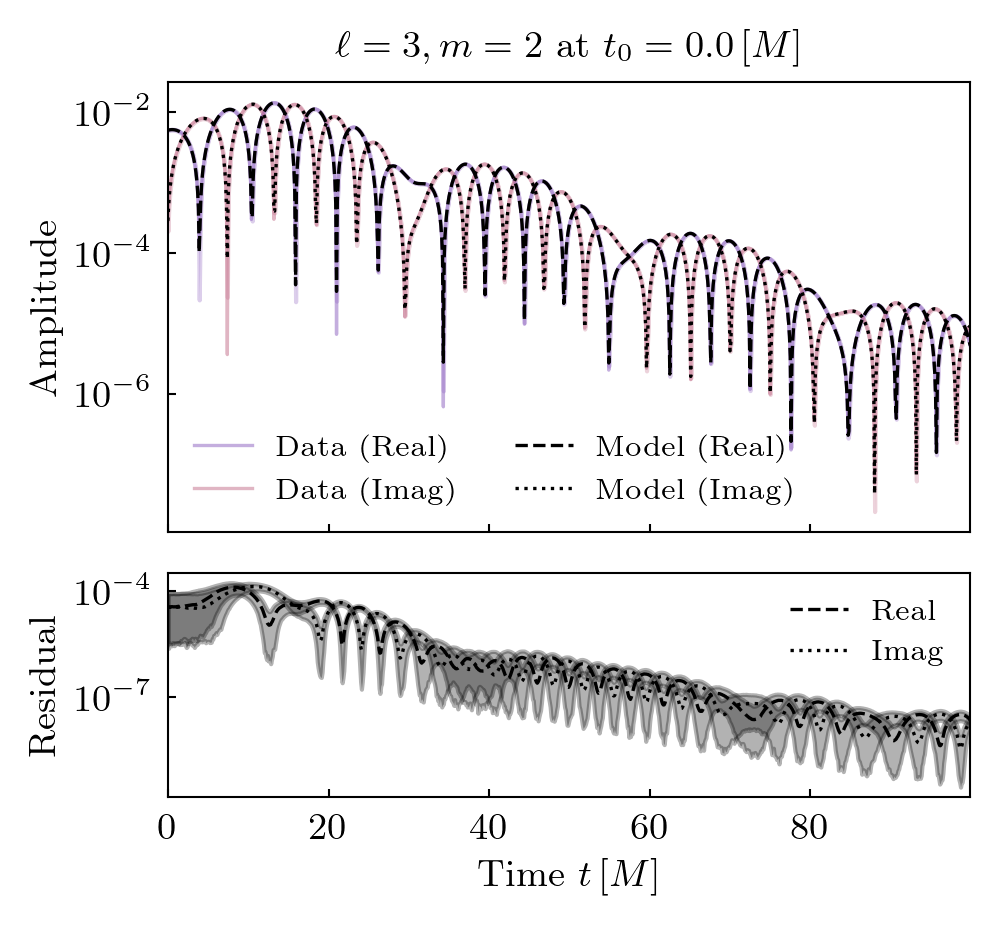
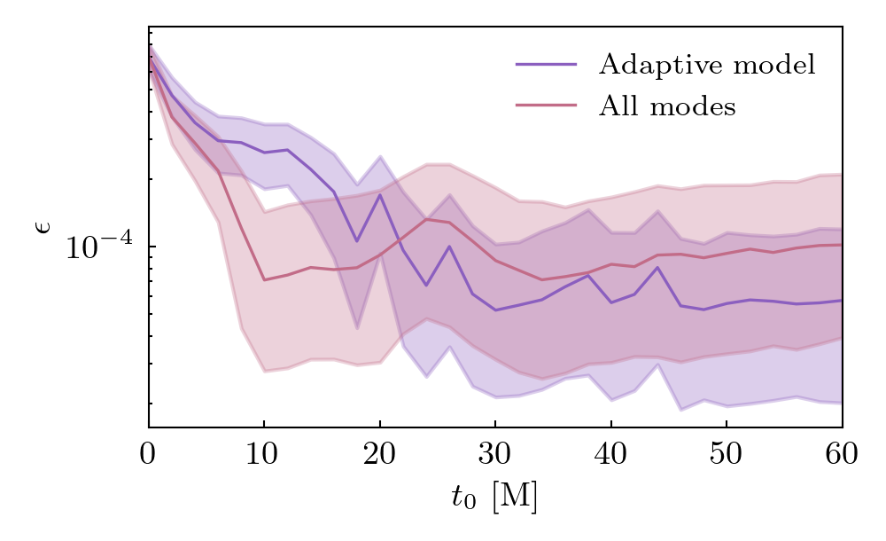
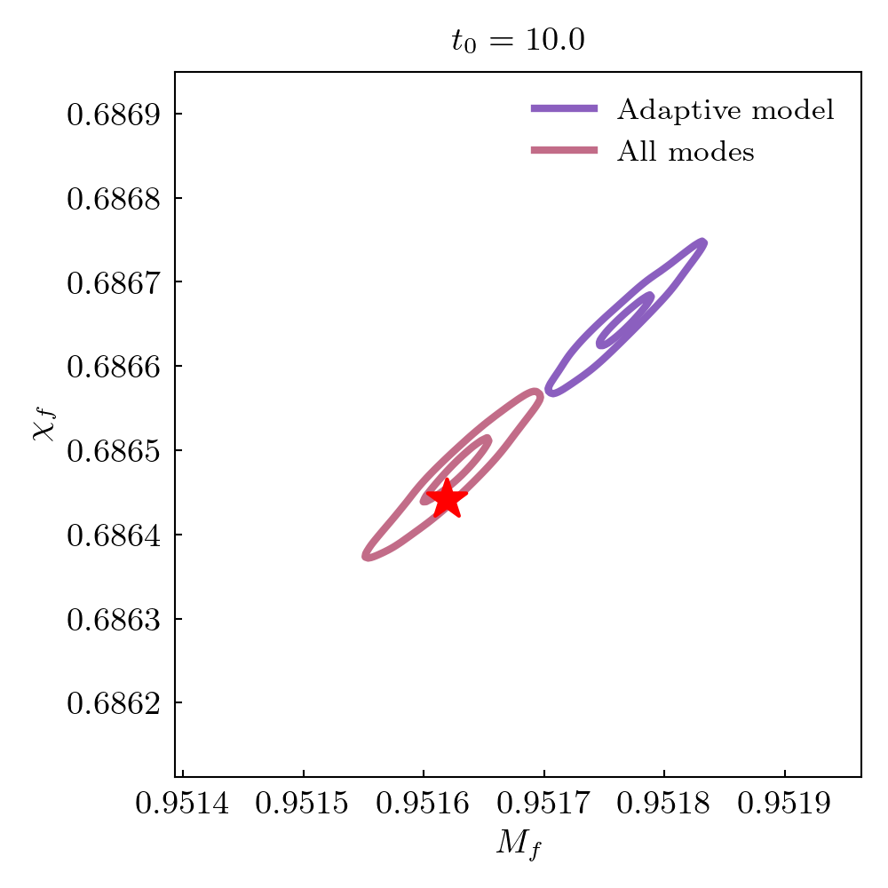
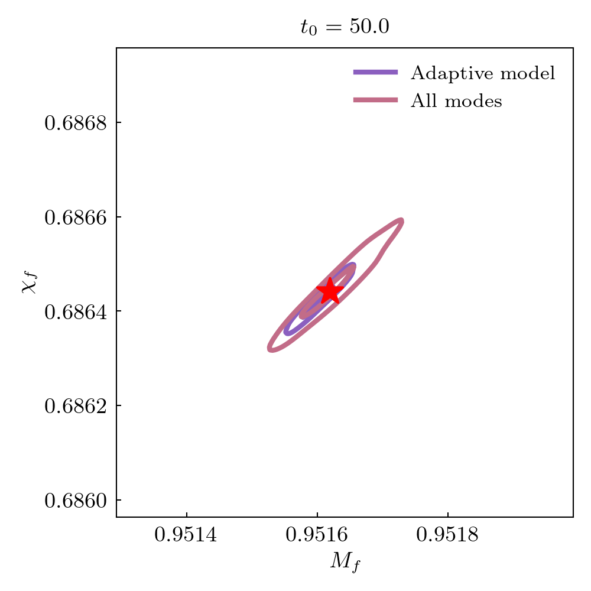

Simulation 0001
===========================

+-----------------------+-------------------------+
| Metadata Field        | Value                   |
+=======================+=========================+
| Simulation ID         | 0001                    |
+-----------------------+-------------------------+
| Name                  | q1_nospin               |
+-----------------------+-------------------------+
| Mass Ratio            | 1                       |
+-----------------------+-------------------------+
| Spin 1                | (0, 0, 0)               |
+-----------------------+-------------------------+
| Spin 2                | (0, 0, 0)               |
+-----------------------+-------------------------+
| Final Mass            | 0.952                   |
+-----------------------+-------------------------+
| Final Spin            | 0.686                   |
+-----------------------+-------------------------+

**Spherical harmonics (included in the fits):**

::

    [(2, 2), (3, 2), (4, 2)]

**Target harmonics (included in the figures):**

::

    [(2, 2), (3, 2)]

**Candidate modes considered:**

Tuples of length 2 / 4 / 8 / 12 are constant terms / QNMs / quadratic QNMs / cubic QNMs. 

::

    [(2, 2, 0, 1), (2, 2, 1, 1), (2, 2, 2, 1), (2, 2, 3, 1), (2, 2, 4, 1), (2, 2, 5, 1), (2, 2, 6, 1), (3, 2, 0, 1), (3, 2, 1, 1), (3, 2, 2, 1), (3, 2, 3, 1), (3, 2, 4, 1), (3, 2, 5, 1), (3, 2, 6, 1), (4, 2, 0, 1), (4, 2, 1, 1), (4, 2, 2, 1), (4, 2, 3, 1), (4, 2, 4, 1), (4, 2, 5, 1), (4, 2, 6, 1), (2, 2, 0, -1), (2, 2, 1, -1), (2, 2, 2, -1), (2, 2, 3, -1), (2, 2, 4, -1), (2, 2, 5, -1), (2, 2, 6, -1), (3, 2, 0, -1), (3, 2, 1, -1), (3, 2, 2, -1), (3, 2, 3, -1), (3, 2, 4, -1), (3, 2, 5, -1), (3, 2, 6, -1), (4, 2, 0, -1), (4, 2, 1, -1), (4, 2, 2, -1), (4, 2, 3, -1), (4, 2, 4, -1), (4, 2, 5, -1), (4, 2, 6, -1), (2, 2), (3, 2), (4, 2)]

Mode Content
------------

Times QNMs are present is shown below. Solid lines indicate prograde modes, hatched lines indicate retrograde modes. Vertical grey shaded regions (where present) show poor fit times.

Amplitude Stability
-------------------

Decay-corrected amplitudes are shown with the median as a bold line and 90% region shaded. Vertical grey shaded regions (where present) show poor fit times.

Fits
----

Model fits and data with residuals are shown. Start time is the earliest step at which the model fits well.

Epsilon
-------

Remnant black hole mass and spin estimates are compared to NR values. Root square distance and posteriors at different start times are shown.

