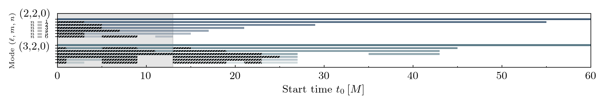
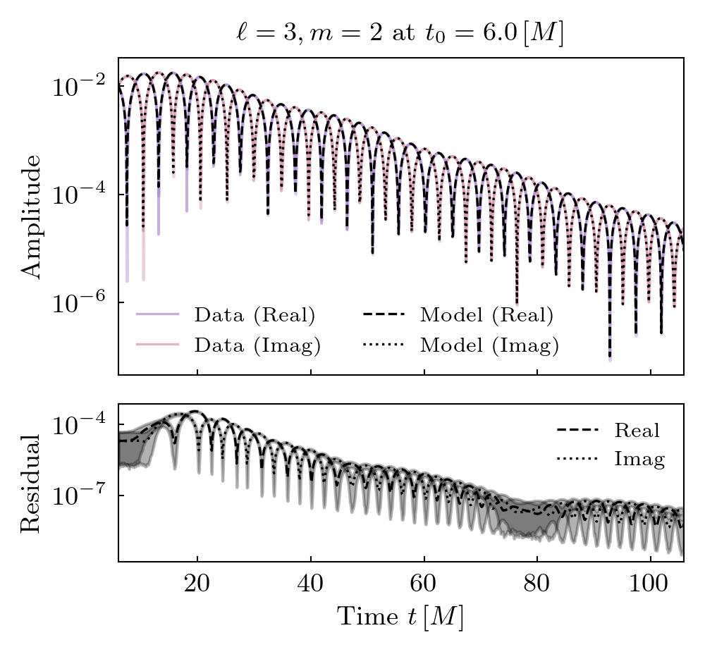

Simulation 0004
===========================

+-----------------------+-------------------------+
| Metadata Field        | Value                   |
+=======================+=========================+
| Simulation ID         | 0004                    |
+-----------------------+-------------------------+
| Name                  | q1_aligned_chi0_6       |
+-----------------------+-------------------------+
| Mass Ratio            | 1                       |
+-----------------------+-------------------------+
| Spin 1                | (0, 0, 0.6)             |
+-----------------------+-------------------------+
| Spin 2                | (0, 0, 0.6)             |
+-----------------------+-------------------------+
| Final Mass            | 0.927                   |
+-----------------------+-------------------------+
| Final Spin            | 0.858                   |
+-----------------------+-------------------------+

**Spherical harmonics (included in the fits):**

::

    [(2, 2), (3, 2), (4, 2)]

**Target harmonics (included in the figures):**

::

    [(2, 2), (3, 2)]

**Candidate modes considered:**

Tuples of length 2 / 4 / 8 / 12 are constant terms / QNMs / quadratic QNMs / cubic QNMs. 

::

    [(2, 2, 0, 1), (2, 2, 1, 1), (2, 2, 2, 1), (2, 2, 3, 1), (2, 2, 4, 1), (2, 2, 5, 1), (2, 2, 6, 1), (3, 2, 0, 1), (3, 2, 1, 1), (3, 2, 2, 1), (3, 2, 3, 1), (3, 2, 4, 1), (3, 2, 5, 1), (3, 2, 6, 1), (4, 2, 0, 1), (4, 2, 1, 1), (4, 2, 2, 1), (4, 2, 3, 1), (4, 2, 4, 1), (4, 2, 5, 1), (4, 2, 6, 1), (2, 2, 0, -1), (2, 2, 1, -1), (2, 2, 2, -1), (2, 2, 3, -1), (2, 2, 4, -1), (2, 2, 5, -1), (2, 2, 6, -1), (3, 2, 0, -1), (3, 2, 1, -1), (3, 2, 2, -1), (3, 2, 3, -1), (3, 2, 4, -1), (3, 2, 5, -1), (3, 2, 6, -1), (4, 2, 0, -1), (4, 2, 1, -1), (4, 2, 2, -1), (4, 2, 3, -1), (4, 2, 4, -1), (4, 2, 5, -1), (4, 2, 6, -1), (2, 2), (3, 2), (4, 2)]

Mode Content
------------

Fits
----

