Simulation 0008
===========================

+-----------------------+-------------------------+
| Metadata Field        | Value                   |
+=======================+=========================+
| Simulation ID         | 0008                    |
+-----------------------+-------------------------+
| Name                  | q1_precessing           |
+-----------------------+-------------------------+
| Mass Ratio            | 1                       |
+-----------------------+-------------------------+
| Spin 1                | (0.487, 0.125, -0.327)  |
+-----------------------+-------------------------+
| Spin 2                | (-0.19, 0.051, -0.227)  |
+-----------------------+-------------------------+
| Final Mass            | 0.958                   |
+-----------------------+-------------------------+
| Final Spin            | 0.603                   |
+-----------------------+-------------------------+

**Spherical harmonics (included in the fits):**

::

    [(2, 2), (3, 2), (3, 3), (4, 3), (2, -2), (3, -2), (3, -3), (4, -3)]

**Target harmonics (included in the figures):**

::

    [(2, 2), (3, 3), (2, -2), (3, -3)]

**Candidate modes considered:**

Tuples of length 2 / 4 / 8 / 12 are constant terms / QNMs / quadratic QNMs / cubic QNMs. 

::

    [(2, 2, 0, 1), (2, 2, 1, 1), (2, 2, 2, 1), (2, 2, 3, 1), (2, 2, 4, 1), (2, 2, 5, 1), (2, 2, 6, 1), (3, 2, 0, 1), (3, 2, 1, 1), (3, 2, 2, 1), (3, 2, 3, 1), (3, 2, 4, 1), (3, 2, 5, 1), (3, 2, 6, 1), (3, 3, 0, 1), (3, 3, 1, 1), (3, 3, 2, 1), (3, 3, 3, 1), (3, 3, 4, 1), (3, 3, 5, 1), (3, 3, 6, 1), (4, 3, 0, 1), (4, 3, 1, 1), (4, 3, 2, 1), (4, 3, 3, 1), (4, 3, 4, 1), (4, 3, 5, 1), (4, 3, 6, 1), (2, -2, 0, 1), (2, -2, 1, 1), (2, -2, 2, 1), (2, -2, 3, 1), (2, -2, 4, 1), (2, -2, 5, 1), (2, -2, 6, 1), (3, -2, 0, 1), (3, -2, 1, 1), (3, -2, 2, 1), (3, -2, 3, 1), (3, -2, 4, 1), (3, -2, 5, 1), (3, -2, 6, 1), (3, -3, 0, 1), (3, -3, 1, 1), (3, -3, 2, 1), (3, -3, 3, 1), (3, -3, 4, 1), (3, -3, 5, 1), (3, -3, 6, 1), (4, -3, 0, 1), (4, -3, 1, 1), (4, -3, 2, 1), (4, -3, 3, 1), (4, -3, 4, 1), (4, -3, 5, 1), (4, -3, 6, 1), (2, 2, 0, -1), (2, 2, 1, -1), (2, 2, 2, -1), (2, 2, 3, -1), (2, 2, 4, -1), (2, 2, 5, -1), (2, 2, 6, -1), (3, 2, 0, -1), (3, 2, 1, -1), (3, 2, 2, -1), (3, 2, 3, -1), (3, 2, 4, -1), (3, 2, 5, -1), (3, 2, 6, -1), (3, 3, 0, -1), (3, 3, 1, -1), (3, 3, 2, -1), (3, 3, 3, -1), (3, 3, 4, -1), (3, 3, 5, -1), (3, 3, 6, -1), (4, 3, 0, -1), (4, 3, 1, -1), (4, 3, 2, -1), (4, 3, 3, -1), (4, 3, 4, -1), (4, 3, 5, -1), (4, 3, 6, -1), (2, -2, 0, -1), (2, -2, 1, -1), (2, -2, 2, -1), (2, -2, 3, -1), (2, -2, 4, -1), (2, -2, 5, -1), (2, -2, 6, -1), (3, -2, 0, -1), (3, -2, 1, -1), (3, -2, 2, -1), (3, -2, 3, -1), (3, -2, 4, -1), (3, -2, 5, -1), (3, -2, 6, -1), (3, -3, 0, -1), (3, -3, 1, -1), (3, -3, 2, -1), (3, -3, 3, -1), (3, -3, 4, -1), (3, -3, 5, -1), (3, -3, 6, -1), (4, -3, 0, -1), (4, -3, 1, -1), (4, -3, 2, -1), (4, -3, 3, -1), (4, -3, 4, -1), (4, -3, 5, -1), (4, -3, 6, -1), (2, 2), (3, 2), (3, 3), (4, 3), (2, -2), (3, -2), (3, -3), (4, -3)]

Mode Content
------------

The start times at which particular QNMs are present in the simulation are shown below. Solid lines indicate prograde modes present, ordered by overtone number. Hatched lines indicate that the retrograde mode is also present. Grey shaded regions indicate the times at which the model is considered a poor fit. If there is no grey region, the model is considered a good fit at all times shown.

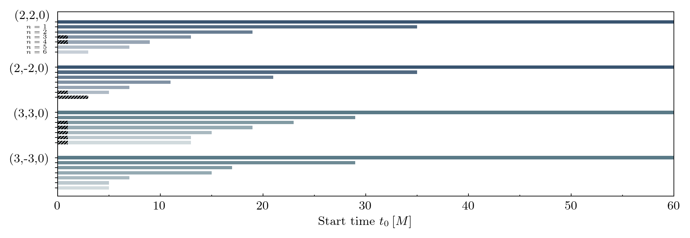

Amplitude Stability
-------------------

The decay-corrected amplitudes are shown below at a range of start times. With the median as a bold line, and 90% region shaded.Grey shaded regions indicate the times at which the model is considered a poor fit. If there is no grey region, the model is considered a good fit at all times shown.

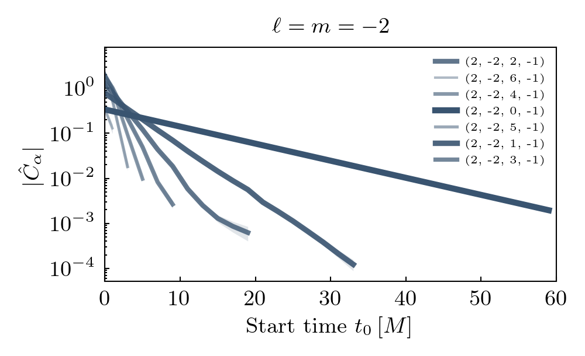

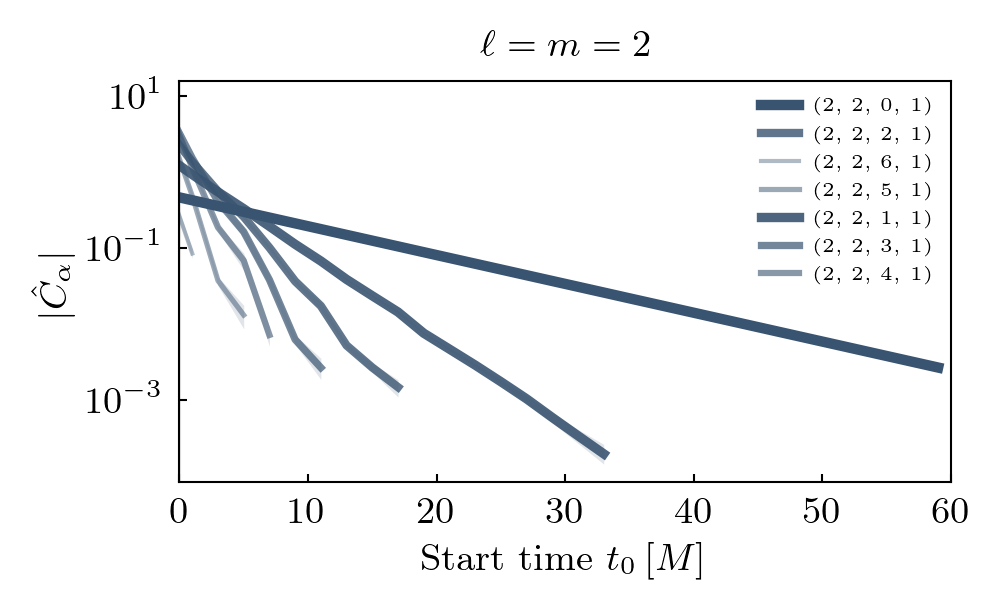

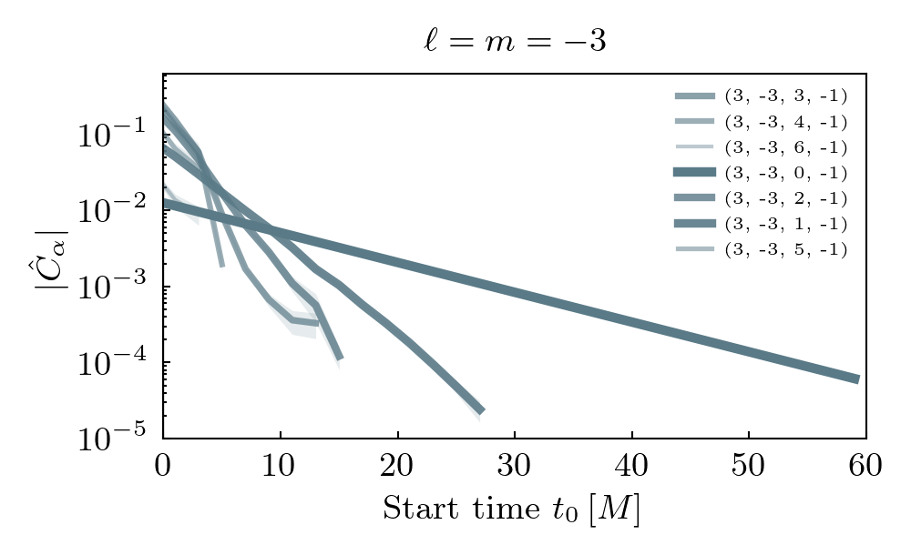

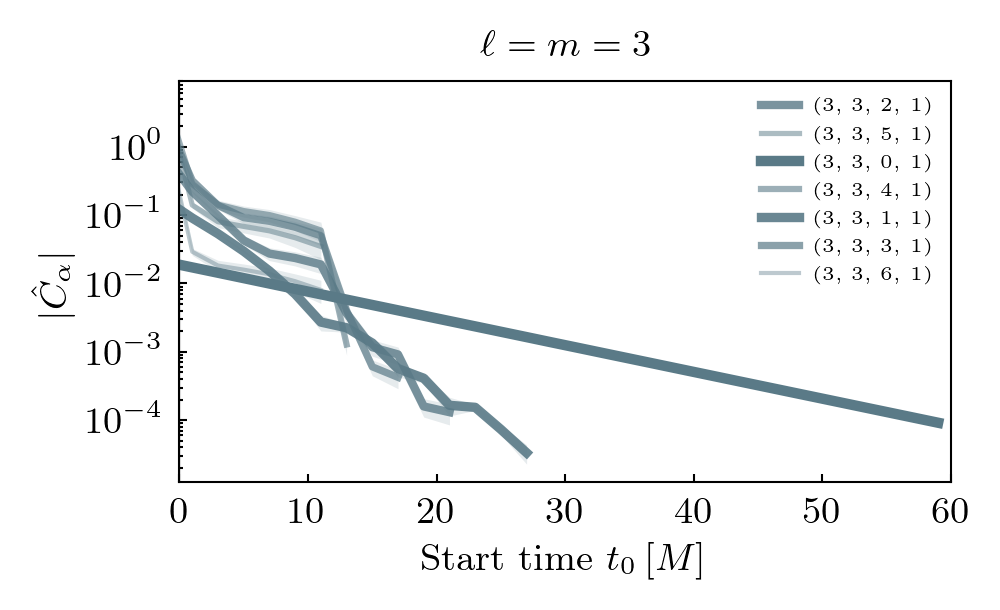

Fits
----

Fits of the model and data are shown below, including residuals. The start time of the fits is the earliest time step at which the model is considered a good fit.

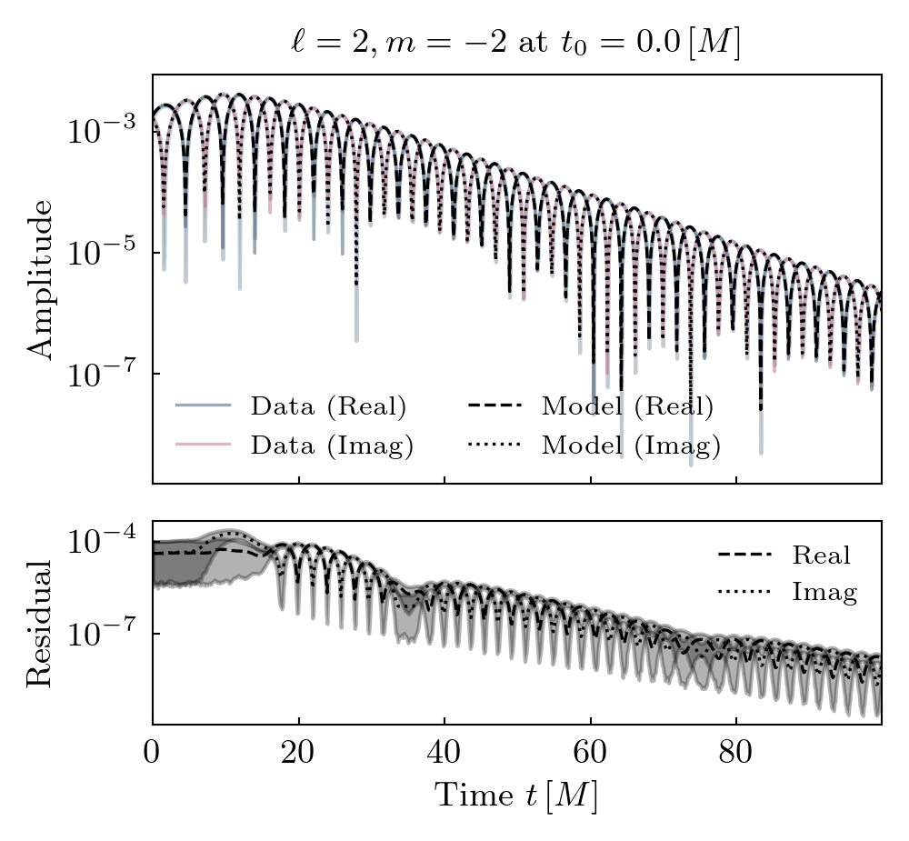

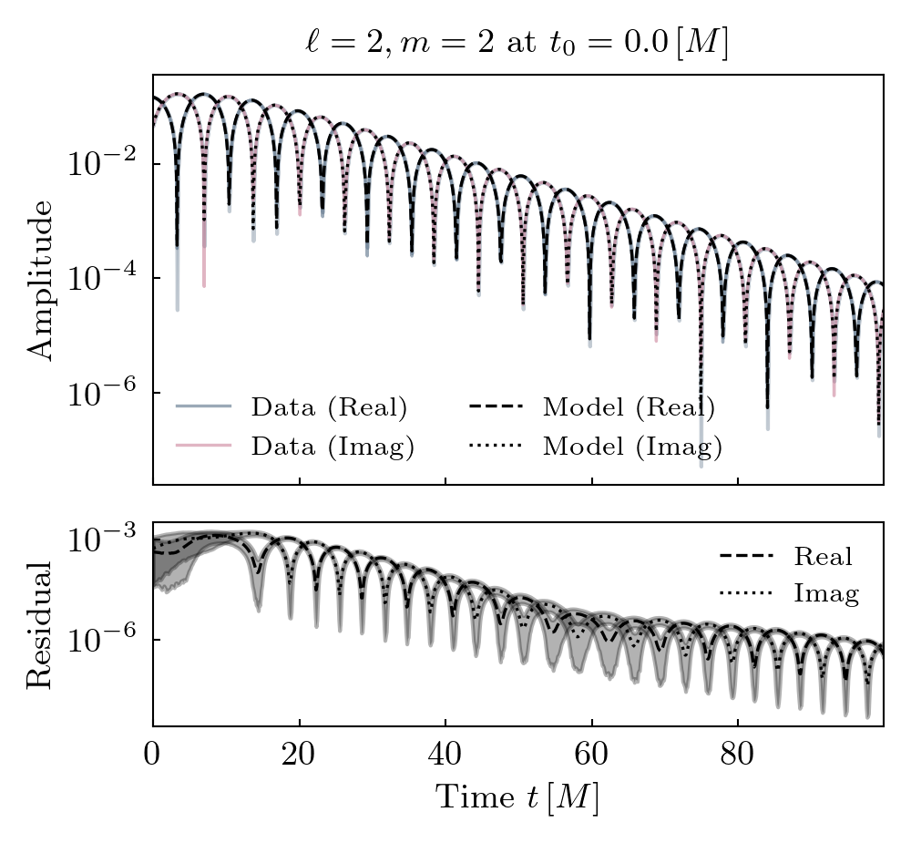

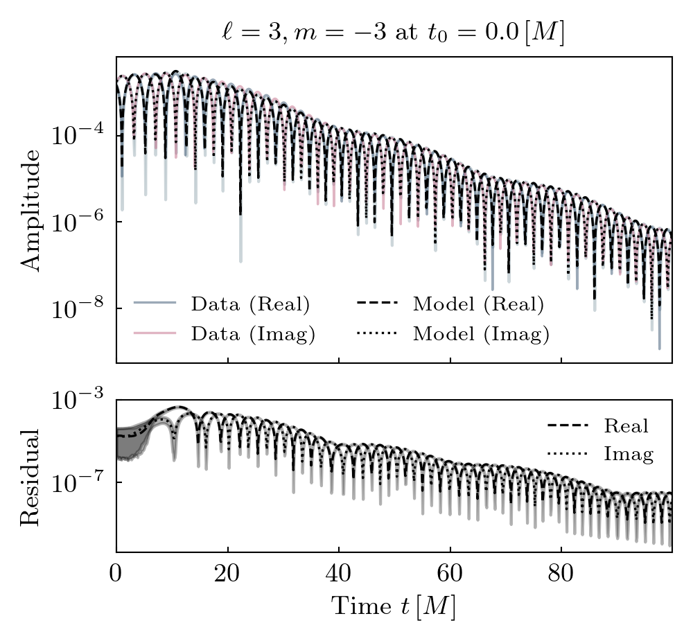

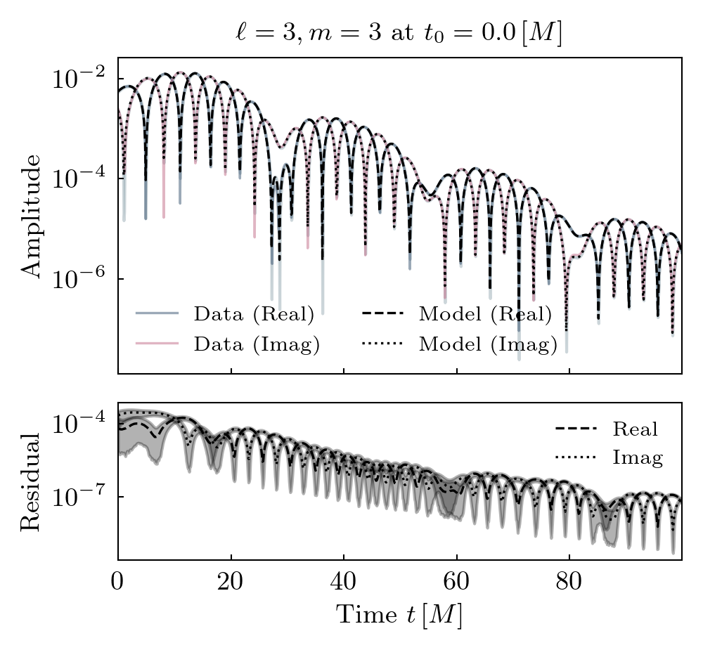

Epsilon
-------

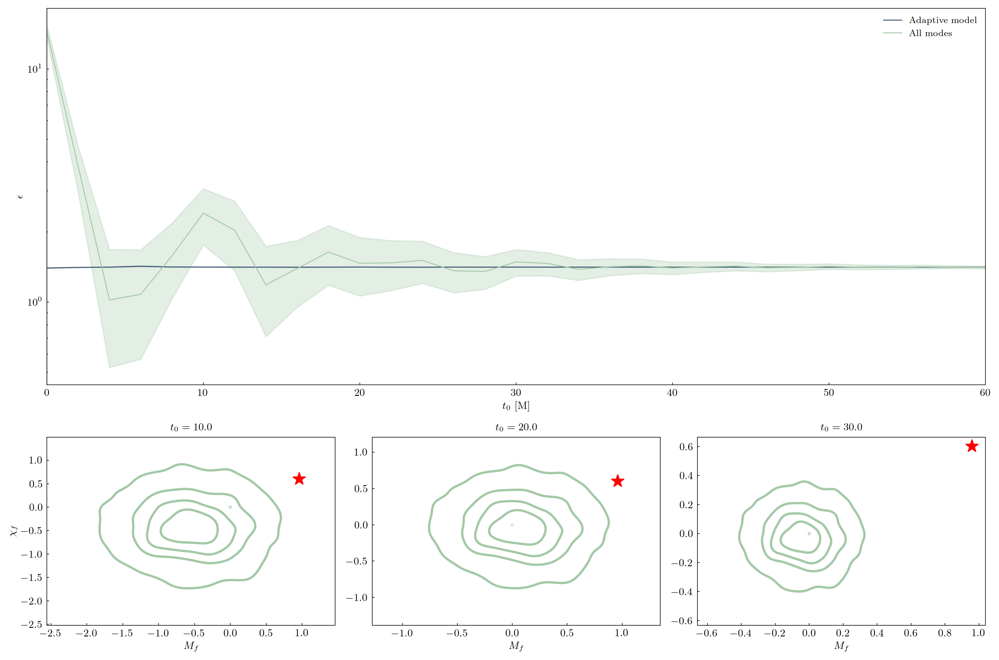

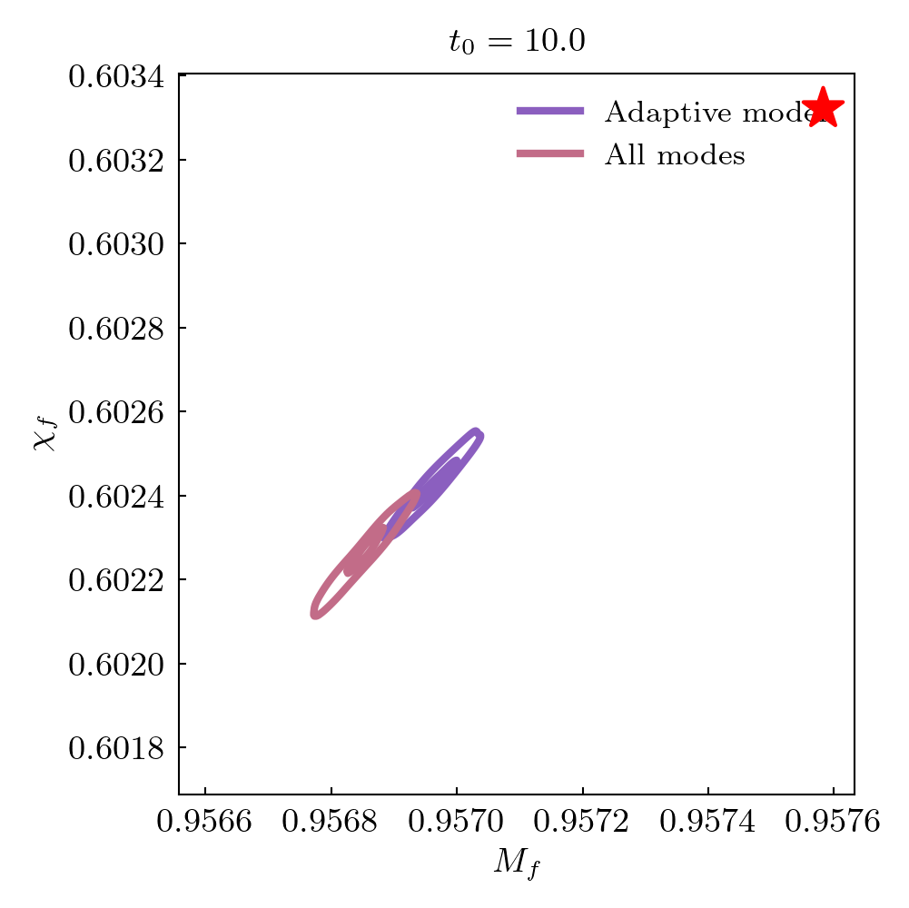

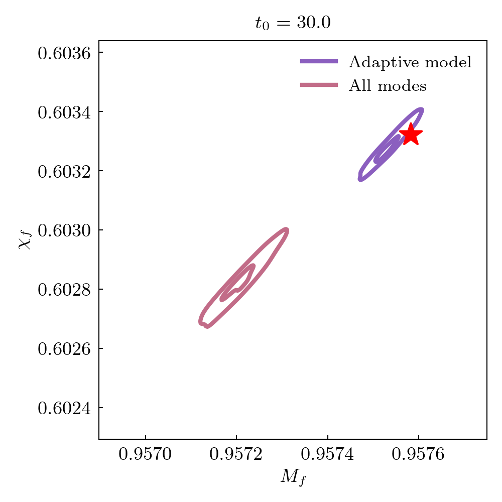

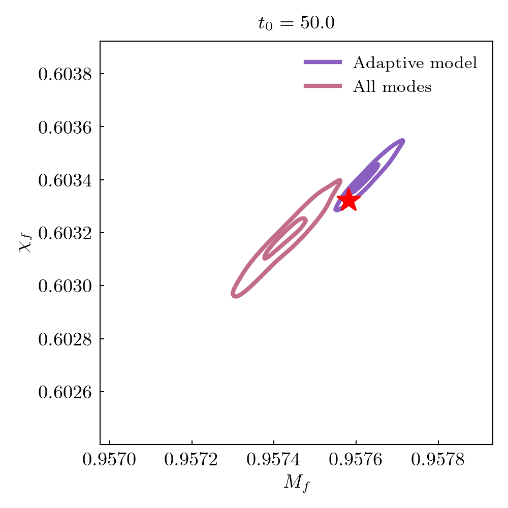

