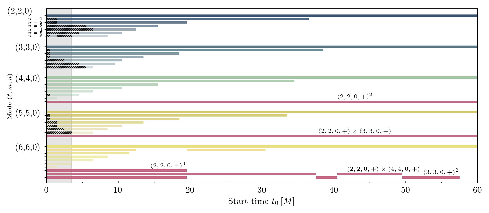
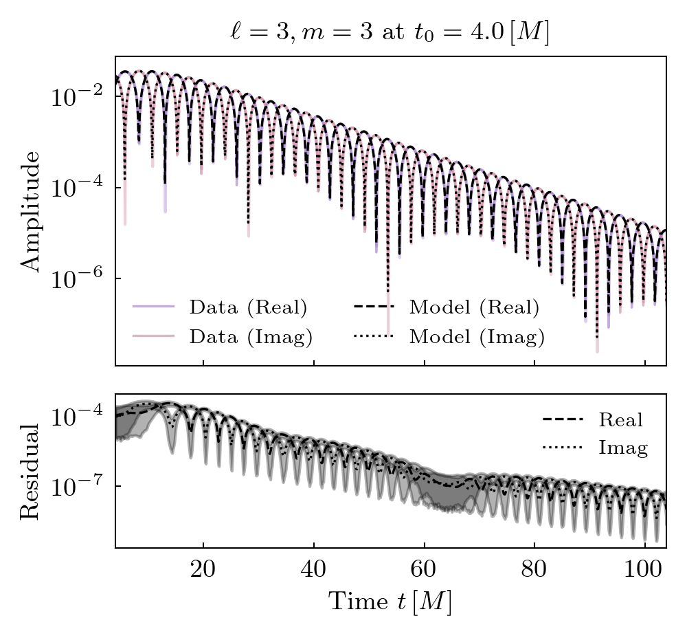
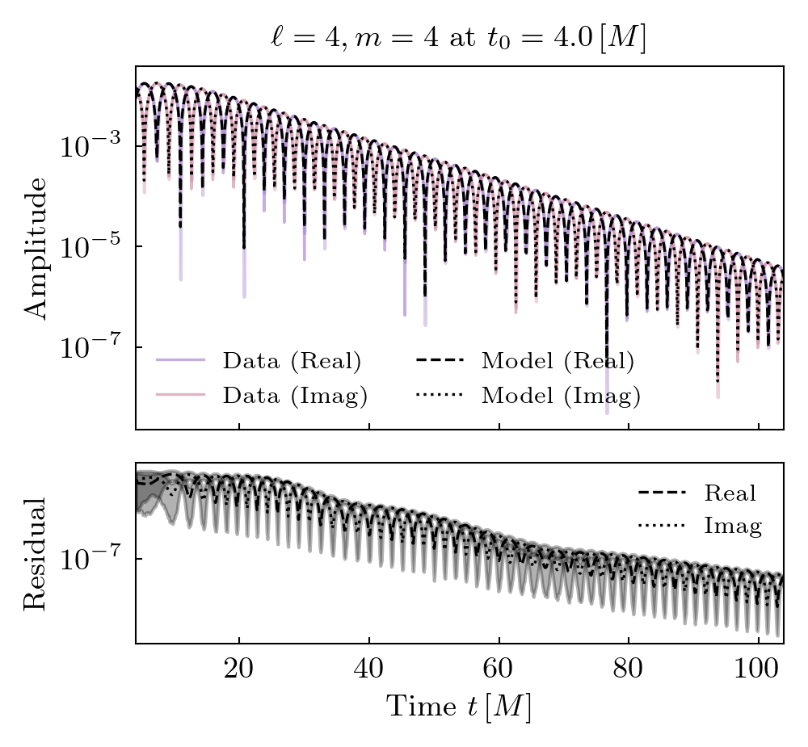
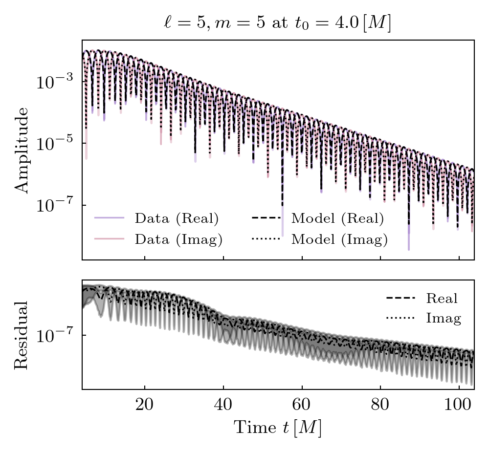

Simulation 0010
===========================

+-----------------------+-------------------------+
| Metadata Field        | Value                   |
+=======================+=========================+
| Simulation ID         | 0010                    |
+-----------------------+-------------------------+
| Name                  | q4_no_spin              |
+-----------------------+-------------------------+
| Mass Ratio            | 4                       |
+-----------------------+-------------------------+
| Spin 1                | (0, 0, 0)               |
+-----------------------+-------------------------+
| Spin 2                | (0, 0, 0)               |
+-----------------------+-------------------------+
| Final Mass            | 0.978                   |
+-----------------------+-------------------------+
| Final Spin            | 0.472                   |
+-----------------------+-------------------------+

**Spherical harmonics (included in the fits):**

::

    [(2, 2), (3, 2), (3, 3), (4, 3), (4, 4), (5, 4), (5, 5), (6, 5), (6, 6), (7, 6)]

**Target harmonics (included in the figures):**

::

    [(2, 2), (3, 3), (4, 4), (5, 5), (6, 6)]

**Candidate modes considered:**

Tuples of length 2 / 4 / 8 / 12 are constant terms / QNMs / quadratic QNMs / cubic QNMs. 

::

    [(2, 2, 0, 1), (2, 2, 1, 1), (2, 2, 2, 1), (2, 2, 3, 1), (2, 2, 4, 1), (2, 2, 5, 1), (2, 2, 6, 1), (3, 2, 0, 1), (3, 2, 1, 1), (3, 2, 2, 1), (3, 2, 3, 1), (3, 2, 4, 1), (3, 2, 5, 1), (3, 2, 6, 1), (3, 3, 0, 1), (3, 3, 1, 1), (3, 3, 2, 1), (3, 3, 3, 1), (3, 3, 4, 1), (3, 3, 5, 1), (3, 3, 6, 1), (4, 3, 0, 1), (4, 3, 1, 1), (4, 3, 2, 1), (4, 3, 3, 1), (4, 3, 4, 1), (4, 3, 5, 1), (4, 3, 6, 1), (4, 4, 0, 1), (4, 4, 1, 1), (4, 4, 2, 1), (4, 4, 3, 1), (4, 4, 4, 1), (4, 4, 5, 1), (4, 4, 6, 1), (5, 4, 0, 1), (5, 4, 1, 1), (5, 4, 2, 1), (5, 4, 3, 1), (5, 4, 4, 1), (5, 4, 5, 1), (5, 4, 6, 1), (5, 5, 0, 1), (5, 5, 1, 1), (5, 5, 2, 1), (5, 5, 3, 1), (5, 5, 4, 1), (5, 5, 5, 1), (5, 5, 6, 1), (6, 5, 0, 1), (6, 5, 1, 1), (6, 5, 2, 1), (6, 5, 3, 1), (6, 5, 4, 1), (6, 5, 5, 1), (6, 5, 6, 1), (6, 6, 0, 1), (6, 6, 1, 1), (6, 6, 2, 1), (6, 6, 3, 1), (6, 6, 4, 1), (6, 6, 5, 1), (6, 6, 6, 1), (7, 6, 0, 1), (7, 6, 1, 1), (7, 6, 2, 1), (7, 6, 3, 1), (7, 6, 4, 1), (7, 6, 5, 1), (7, 6, 6, 1), (2, 2, 0, -1), (2, 2, 1, -1), (2, 2, 2, -1), (2, 2, 3, -1), (2, 2, 4, -1), (2, 2, 5, -1), (2, 2, 6, -1), (3, 2, 0, -1), (3, 2, 1, -1), (3, 2, 2, -1), (3, 2, 3, -1), (3, 2, 4, -1), (3, 2, 5, -1), (3, 2, 6, -1), (3, 3, 0, -1), (3, 3, 1, -1), (3, 3, 2, -1), (3, 3, 3, -1), (3, 3, 4, -1), (3, 3, 5, -1), (3, 3, 6, -1), (4, 3, 0, -1), (4, 3, 1, -1), (4, 3, 2, -1), (4, 3, 3, -1), (4, 3, 4, -1), (4, 3, 5, -1), (4, 3, 6, -1), (4, 4, 0, -1), (4, 4, 1, -1), (4, 4, 2, -1), (4, 4, 3, -1), (4, 4, 4, -1), (4, 4, 5, -1), (4, 4, 6, -1), (5, 4, 0, -1), (5, 4, 1, -1), (5, 4, 2, -1), (5, 4, 3, -1), (5, 4, 4, -1), (5, 4, 5, -1), (5, 4, 6, -1), (5, 5, 0, -1), (5, 5, 1, -1), (5, 5, 2, -1), (5, 5, 3, -1), (5, 5, 4, -1), (5, 5, 5, -1), (5, 5, 6, -1), (6, 5, 0, -1), (6, 5, 1, -1), (6, 5, 2, -1), (6, 5, 3, -1), (6, 5, 4, -1), (6, 5, 5, -1), (6, 5, 6, -1), (6, 6, 0, -1), (6, 6, 1, -1), (6, 6, 2, -1), (6, 6, 3, -1), (6, 6, 4, -1), (6, 6, 5, -1), (6, 6, 6, -1), (7, 6, 0, -1), (7, 6, 1, -1), (7, 6, 2, -1), (7, 6, 3, -1), (7, 6, 4, -1), (7, 6, 5, -1), (7, 6, 6, -1), (2, 2), (3, 2), (3, 3), (4, 3), (4, 4), (5, 4), (5, 5), (6, 5), (6, 6), (7, 6), (2, 2, 0, 1, 2, 2, 0, 1), (2, 2, 0, 1, 3, 3, 0, 1), (3, 3, 0, 1, 3, 3, 0, 1), (2, 2, 0, 1, 4, 4, 0, 1), (2, 2, 0, 1, 2, 2, 0, 1, 2, 2, 0, 1)]

Mode Content
------------

Fits
----

.. image:: figures/0010/fits/fits_66.png
   :width: 600px
   :alt: fits_66.png

