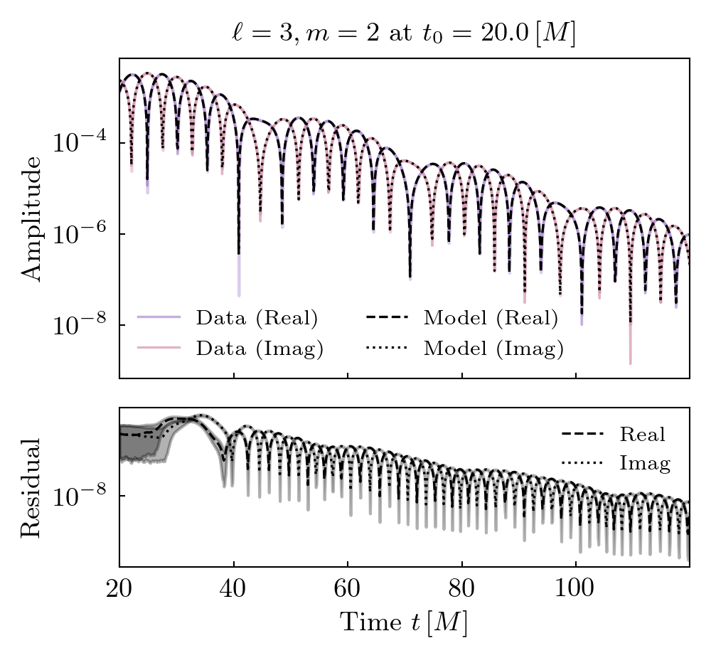
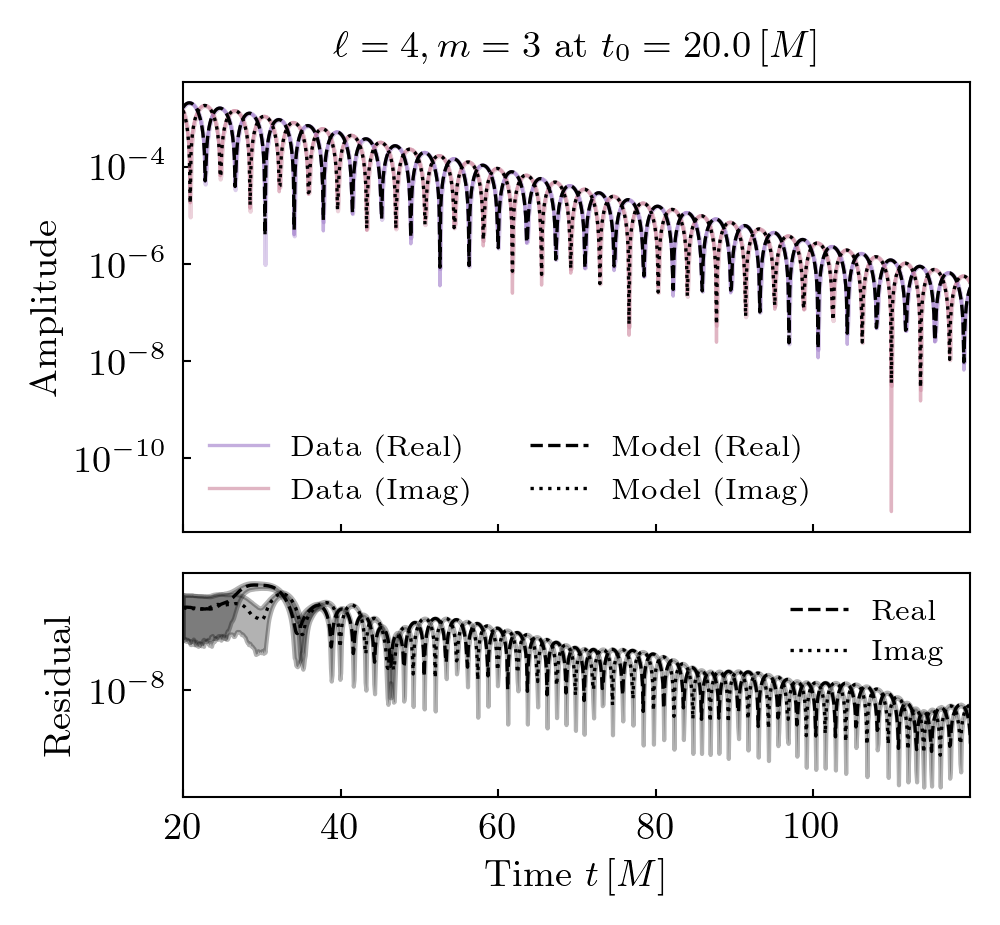
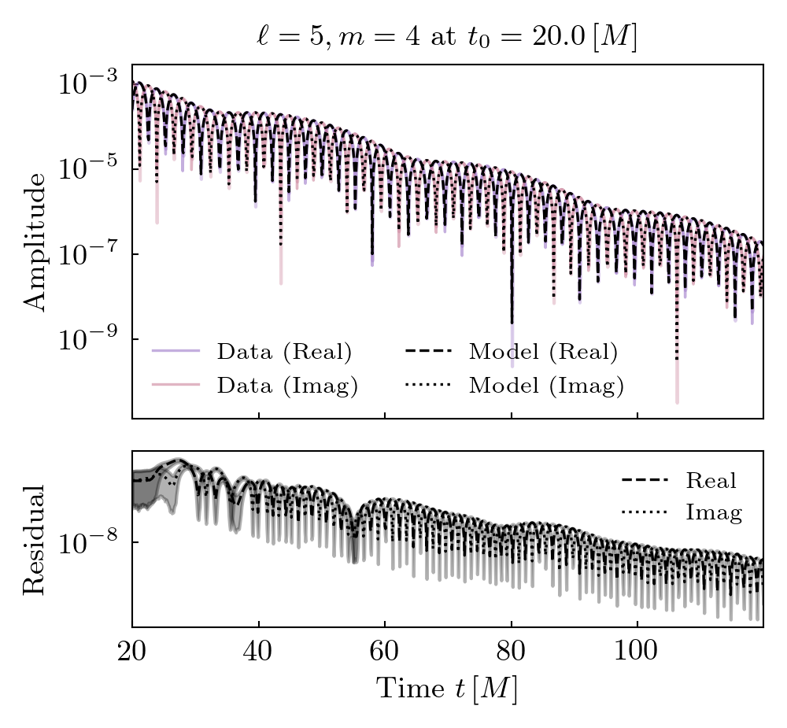
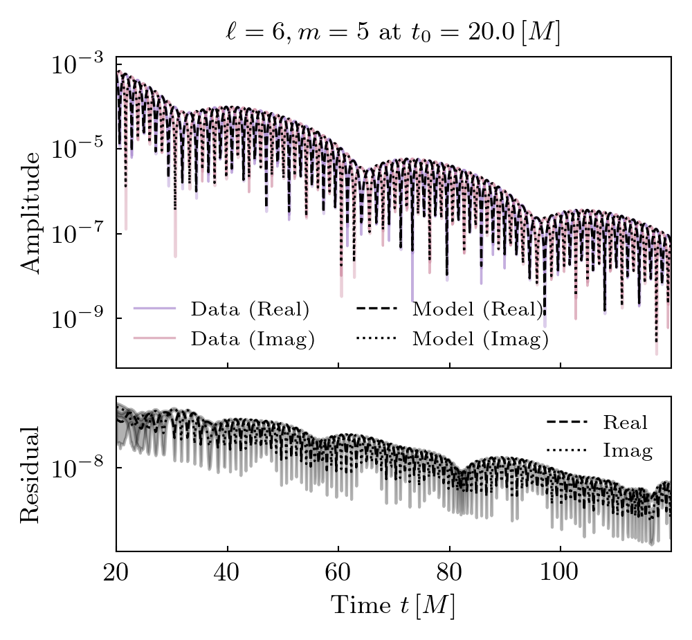
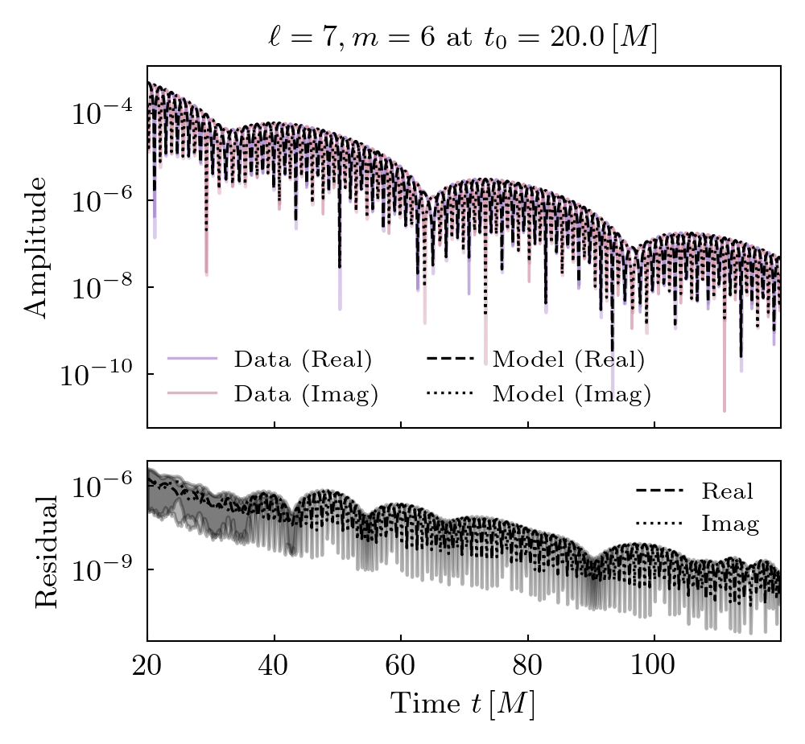

Simulation 0012
===========================

+-----------------------+-------------------------+
| Metadata Field        | Value                   |
+=======================+=========================+
| Simulation ID         | 0012                    |
+-----------------------+-------------------------+
| Name                  | q4_antialigned_chi0_4   |
+-----------------------+-------------------------+
| Mass Ratio            | 4                       |
+-----------------------+-------------------------+
| Spin 1                | (0, 0, 0.4)             |
+-----------------------+-------------------------+
| Spin 2                | (0, 0, -0.4)            |
+-----------------------+-------------------------+
| Final Mass            | 0.972                   |
+-----------------------+-------------------------+
| Final Spin            | 0.672                   |
+-----------------------+-------------------------+

**Spherical harmonics (included in the fits):**

::

    [(2, 2), (3, 2), (3, 3), (4, 3), (4, 4), (5, 4), (5, 5), (6, 5), (6, 6), (7, 6)]

**Target harmonics (included in the figures):**

::

    [(2, 2), (3, 3), (4, 4), (5, 5), (6, 6)]

**Candidate modes considered:**

Tuples of length 2 / 4 / 8 / 12 are constant terms / QNMs / quadratic QNMs / cubic QNMs. 

::

    [(2, 2, 0, 1), (2, 2, 1, 1), (2, 2, 2, 1), (2, 2, 3, 1), (2, 2, 4, 1), (2, 2, 5, 1), (2, 2, 6, 1), (3, 2, 0, 1), (3, 2, 1, 1), (3, 2, 2, 1), (3, 2, 3, 1), (3, 2, 4, 1), (3, 2, 5, 1), (3, 2, 6, 1), (3, 3, 0, 1), (3, 3, 1, 1), (3, 3, 2, 1), (3, 3, 3, 1), (3, 3, 4, 1), (3, 3, 5, 1), (3, 3, 6, 1), (4, 3, 0, 1), (4, 3, 1, 1), (4, 3, 2, 1), (4, 3, 3, 1), (4, 3, 4, 1), (4, 3, 5, 1), (4, 3, 6, 1), (4, 4, 0, 1), (4, 4, 1, 1), (4, 4, 2, 1), (4, 4, 3, 1), (4, 4, 4, 1), (4, 4, 5, 1), (4, 4, 6, 1), (5, 4, 0, 1), (5, 4, 1, 1), (5, 4, 2, 1), (5, 4, 3, 1), (5, 4, 4, 1), (5, 4, 5, 1), (5, 4, 6, 1), (5, 5, 0, 1), (5, 5, 1, 1), (5, 5, 2, 1), (5, 5, 3, 1), (5, 5, 4, 1), (5, 5, 5, 1), (5, 5, 6, 1), (6, 5, 0, 1), (6, 5, 1, 1), (6, 5, 2, 1), (6, 5, 3, 1), (6, 5, 4, 1), (6, 5, 5, 1), (6, 5, 6, 1), (6, 6, 0, 1), (6, 6, 1, 1), (6, 6, 2, 1), (6, 6, 3, 1), (6, 6, 4, 1), (6, 6, 5, 1), (6, 6, 6, 1), (7, 6, 0, 1), (7, 6, 1, 1), (7, 6, 2, 1), (7, 6, 3, 1), (7, 6, 4, 1), (7, 6, 5, 1), (7, 6, 6, 1), (2, 2, 0, -1), (2, 2, 1, -1), (2, 2, 2, -1), (2, 2, 3, -1), (2, 2, 4, -1), (2, 2, 5, -1), (2, 2, 6, -1), (3, 2, 0, -1), (3, 2, 1, -1), (3, 2, 2, -1), (3, 2, 3, -1), (3, 2, 4, -1), (3, 2, 5, -1), (3, 2, 6, -1), (3, 3, 0, -1), (3, 3, 1, -1), (3, 3, 2, -1), (3, 3, 3, -1), (3, 3, 4, -1), (3, 3, 5, -1), (3, 3, 6, -1), (4, 3, 0, -1), (4, 3, 1, -1), (4, 3, 2, -1), (4, 3, 3, -1), (4, 3, 4, -1), (4, 3, 5, -1), (4, 3, 6, -1), (4, 4, 0, -1), (4, 4, 1, -1), (4, 4, 2, -1), (4, 4, 3, -1), (4, 4, 4, -1), (4, 4, 5, -1), (4, 4, 6, -1), (5, 4, 0, -1), (5, 4, 1, -1), (5, 4, 2, -1), (5, 4, 3, -1), (5, 4, 4, -1), (5, 4, 5, -1), (5, 4, 6, -1), (5, 5, 0, -1), (5, 5, 1, -1), (5, 5, 2, -1), (5, 5, 3, -1), (5, 5, 4, -1), (5, 5, 5, -1), (5, 5, 6, -1), (6, 5, 0, -1), (6, 5, 1, -1), (6, 5, 2, -1), (6, 5, 3, -1), (6, 5, 4, -1), (6, 5, 5, -1), (6, 5, 6, -1), (6, 6, 0, -1), (6, 6, 1, -1), (6, 6, 2, -1), (6, 6, 3, -1), (6, 6, 4, -1), (6, 6, 5, -1), (6, 6, 6, -1), (7, 6, 0, -1), (7, 6, 1, -1), (7, 6, 2, -1), (7, 6, 3, -1), (7, 6, 4, -1), (7, 6, 5, -1), (7, 6, 6, -1), (2, 2), (3, 2), (3, 3), (4, 3), (4, 4), (5, 4), (5, 5), (6, 5), (6, 6), (7, 6), (2, 2, 0, 1, 2, 2, 0, 1), (2, 2, 0, 1, 3, 3, 0, 1), (3, 3, 0, 1, 3, 3, 0, 1), (2, 2, 0, 1, 4, 4, 0, 1), (2, 2, 0, 1, 2, 2, 0, 1, 2, 2, 0, 1)]

Mode Content
------------

.. image:: figures/0012/mode_content/mode_content.png
   :width: 600px
   :alt: mode_content.png

Amplitude Stability
-------------------

.. image:: figures/0012/amplitude_stability/amplitude_stability_2-1.png
   :width: 600px
   :alt: amplitude_stability_2-1.png

.. image:: figures/0012/amplitude_stability/amplitude_stability_2-2.png
   :width: 600px
   :alt: amplitude_stability_2-2.png

.. image:: figures/0012/amplitude_stability/amplitude_stability_20.png
   :width: 600px
   :alt: amplitude_stability_20.png

.. image:: figures/0012/amplitude_stability/amplitude_stability_21.png
   :width: 600px
   :alt: amplitude_stability_21.png

.. image:: figures/0012/amplitude_stability/amplitude_stability_22.png
   :width: 600px
   :alt: amplitude_stability_22.png

.. image:: figures/0012/amplitude_stability/amplitude_stability_3-1.png
   :width: 600px
   :alt: amplitude_stability_3-1.png

.. image:: figures/0012/amplitude_stability/amplitude_stability_3-2.png
   :width: 600px
   :alt: amplitude_stability_3-2.png

.. image:: figures/0012/amplitude_stability/amplitude_stability_3-3.png
   :width: 600px
   :alt: amplitude_stability_3-3.png

.. image:: figures/0012/amplitude_stability/amplitude_stability_30.png
   :width: 600px
   :alt: amplitude_stability_30.png

.. image:: figures/0012/amplitude_stability/amplitude_stability_31.png
   :width: 600px
   :alt: amplitude_stability_31.png

.. image:: figures/0012/amplitude_stability/amplitude_stability_32.png
   :width: 600px
   :alt: amplitude_stability_32.png

.. image:: figures/0012/amplitude_stability/amplitude_stability_33.png
   :width: 600px
   :alt: amplitude_stability_33.png

.. image:: figures/0012/amplitude_stability/amplitude_stability_4-1.png
   :width: 600px
   :alt: amplitude_stability_4-1.png

.. image:: figures/0012/amplitude_stability/amplitude_stability_4-2.png
   :width: 600px
   :alt: amplitude_stability_4-2.png

.. image:: figures/0012/amplitude_stability/amplitude_stability_4-3.png
   :width: 600px
   :alt: amplitude_stability_4-3.png

.. image:: figures/0012/amplitude_stability/amplitude_stability_4-4.png
   :width: 600px
   :alt: amplitude_stability_4-4.png

.. image:: figures/0012/amplitude_stability/amplitude_stability_40.png
   :width: 600px
   :alt: amplitude_stability_40.png

.. image:: figures/0012/amplitude_stability/amplitude_stability_41.png
   :width: 600px
   :alt: amplitude_stability_41.png

.. image:: figures/0012/amplitude_stability/amplitude_stability_42.png
   :width: 600px
   :alt: amplitude_stability_42.png

.. image:: figures/0012/amplitude_stability/amplitude_stability_43.png
   :width: 600px
   :alt: amplitude_stability_43.png

.. image:: figures/0012/amplitude_stability/amplitude_stability_44.png
   :width: 600px
   :alt: amplitude_stability_44.png

.. image:: figures/0012/amplitude_stability/amplitude_stability_5-1.png
   :width: 600px
   :alt: amplitude_stability_5-1.png

.. image:: figures/0012/amplitude_stability/amplitude_stability_5-2.png
   :width: 600px
   :alt: amplitude_stability_5-2.png

.. image:: figures/0012/amplitude_stability/amplitude_stability_5-3.png
   :width: 600px
   :alt: amplitude_stability_5-3.png

.. image:: figures/0012/amplitude_stability/amplitude_stability_5-4.png
   :width: 600px
   :alt: amplitude_stability_5-4.png

.. image:: figures/0012/amplitude_stability/amplitude_stability_5-5.png
   :width: 600px
   :alt: amplitude_stability_5-5.png

.. image:: figures/0012/amplitude_stability/amplitude_stability_50.png
   :width: 600px
   :alt: amplitude_stability_50.png

.. image:: figures/0012/amplitude_stability/amplitude_stability_51.png
   :width: 600px
   :alt: amplitude_stability_51.png

.. image:: figures/0012/amplitude_stability/amplitude_stability_52.png
   :width: 600px
   :alt: amplitude_stability_52.png

.. image:: figures/0012/amplitude_stability/amplitude_stability_53.png
   :width: 600px
   :alt: amplitude_stability_53.png

.. image:: figures/0012/amplitude_stability/amplitude_stability_54.png
   :width: 600px
   :alt: amplitude_stability_54.png

.. image:: figures/0012/amplitude_stability/amplitude_stability_55.png
   :width: 600px
   :alt: amplitude_stability_55.png

.. image:: figures/0012/amplitude_stability/amplitude_stability_6-1.png
   :width: 600px
   :alt: amplitude_stability_6-1.png

.. image:: figures/0012/amplitude_stability/amplitude_stability_6-2.png
   :width: 600px
   :alt: amplitude_stability_6-2.png

.. image:: figures/0012/amplitude_stability/amplitude_stability_6-3.png
   :width: 600px
   :alt: amplitude_stability_6-3.png

.. image:: figures/0012/amplitude_stability/amplitude_stability_6-4.png
   :width: 600px
   :alt: amplitude_stability_6-4.png

.. image:: figures/0012/amplitude_stability/amplitude_stability_6-5.png
   :width: 600px
   :alt: amplitude_stability_6-5.png

.. image:: figures/0012/amplitude_stability/amplitude_stability_6-6.png
   :width: 600px
   :alt: amplitude_stability_6-6.png

.. image:: figures/0012/amplitude_stability/amplitude_stability_60.png
   :width: 600px
   :alt: amplitude_stability_60.png

.. image:: figures/0012/amplitude_stability/amplitude_stability_61.png
   :width: 600px
   :alt: amplitude_stability_61.png

.. image:: figures/0012/amplitude_stability/amplitude_stability_62.png
   :width: 600px
   :alt: amplitude_stability_62.png

.. image:: figures/0012/amplitude_stability/amplitude_stability_63.png
   :width: 600px
   :alt: amplitude_stability_63.png

.. image:: figures/0012/amplitude_stability/amplitude_stability_64.png
   :width: 600px
   :alt: amplitude_stability_64.png

.. image:: figures/0012/amplitude_stability/amplitude_stability_65.png
   :width: 600px
   :alt: amplitude_stability_65.png

.. image:: figures/0012/amplitude_stability/amplitude_stability_66.png
   :width: 600px
   :alt: amplitude_stability_66.png

.. image:: figures/0012/amplitude_stability/amplitude_stability_7-1.png
   :width: 600px
   :alt: amplitude_stability_7-1.png

.. image:: figures/0012/amplitude_stability/amplitude_stability_7-2.png
   :width: 600px
   :alt: amplitude_stability_7-2.png

.. image:: figures/0012/amplitude_stability/amplitude_stability_7-3.png
   :width: 600px
   :alt: amplitude_stability_7-3.png

.. image:: figures/0012/amplitude_stability/amplitude_stability_7-4.png
   :width: 600px
   :alt: amplitude_stability_7-4.png

.. image:: figures/0012/amplitude_stability/amplitude_stability_7-5.png
   :width: 600px
   :alt: amplitude_stability_7-5.png

.. image:: figures/0012/amplitude_stability/amplitude_stability_7-6.png
   :width: 600px
   :alt: amplitude_stability_7-6.png

.. image:: figures/0012/amplitude_stability/amplitude_stability_7-7.png
   :width: 600px
   :alt: amplitude_stability_7-7.png

.. image:: figures/0012/amplitude_stability/amplitude_stability_70.png
   :width: 600px
   :alt: amplitude_stability_70.png

.. image:: figures/0012/amplitude_stability/amplitude_stability_71.png
   :width: 600px
   :alt: amplitude_stability_71.png

.. image:: figures/0012/amplitude_stability/amplitude_stability_72.png
   :width: 600px
   :alt: amplitude_stability_72.png

.. image:: figures/0012/amplitude_stability/amplitude_stability_73.png
   :width: 600px
   :alt: amplitude_stability_73.png

.. image:: figures/0012/amplitude_stability/amplitude_stability_74.png
   :width: 600px
   :alt: amplitude_stability_74.png

.. image:: figures/0012/amplitude_stability/amplitude_stability_75.png
   :width: 600px
   :alt: amplitude_stability_75.png

.. image:: figures/0012/amplitude_stability/amplitude_stability_76.png
   :width: 600px
   :alt: amplitude_stability_76.png

.. image:: figures/0012/amplitude_stability/amplitude_stability_77.png
   :width: 600px
   :alt: amplitude_stability_77.png

Fits
----

.. image:: figures/0012/fits/fits_22.png
   :width: 600px
   :alt: fits_22.png

.. image:: figures/0012/fits/fits_33.png
   :width: 600px
   :alt: fits_33.png

.. image:: figures/0012/fits/fits_44.png
   :width: 600px
   :alt: fits_44.png

.. image:: figures/0012/fits/fits_55.png
   :width: 600px
   :alt: fits_55.png

.. image:: figures/0012/fits/fits_66.png
   :width: 600px
   :alt: fits_66.png

